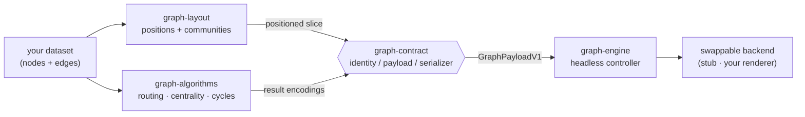

# fxyz-graph

[](https://github.com/fxyznetwork/fxyz-graph/actions/workflows/ci.yml)

A headless, backend-agnostic graph-rendering stack: a shared identity/payload
contract, a venue-agnostic algorithm registry, a force-directed layout +
community-detection library, and a headless controller that drives a
swappable rendering backend. Nothing in this stack talks to a database
directly — every package takes a plain in-memory dataset (nodes + edges) and
returns typed data. What you render it with, and where your data comes from,
is up to you.

Extracted from the [ƒxyz network](https://fxyz.network) monorepo. See
[NOTICE](./NOTICE) for attribution and [LICENSE](./LICENSE) (Apache-2.0).

## Packages

| Package | What it does |
|---|---|
| [`@fxyz/graph-contract`](./packages/graph-contract) | The identity/payload contract every other layer signs: audience-scoped `GraphRef` ids, id-keyed positions, versioned tier payloads, closed enums for provenance/measure-kind/settlement-state, and a single per-audience serializer. Zero runtime dependencies. |
| [`@fxyz/graph-algorithms`](./packages/graph-algorithms) | A typed algorithm registry where FX-style routing/arbitrage algorithms and classic graph algorithms (centrality, community, pathfinding) are siblings under one `run(workingSet, params) => Promise<AlgoResult>` contract. Pure and dependency-light, so the same algorithm row runs client-side or server-side. |
| [`@fxyz/graph-layout`](./packages/graph-layout) | Layout and data-shaping for a client-supplied graph dataset: `d3-force-3d` 3D force-directed positioning, Louvain community detection (`graphology-communities-louvain`), and a slice builder for producing a positioned, community-colored graph ready to render. |
| [`@fxyz/graph-engine`](./packages/graph-engine) | The headless controller: incremental ingest→diff→apply, a server-positions-first layout policy, id-keyed identity/selection stores, throttled spatial-index hit-testing, budgeted label placement, a lens/styling runtime, and renderers as swappable backends behind an observable-API contract (a stub backend ships here; a rendering-library adapter is wired via an injected constructor). Optional React bindings (`@fxyz/graph-engine/react`) provide a `GraphPane` component. |

`graph-engine` depends only on `graph-contract`. `graph-layout` uses
`graph-contract` at build time to keep its edge-id grammar compatible. Every
package is independently usable.

## Architecture



Data flows in as a plain in-memory graph, gets positioned and analysed, is
serialized through the one identity/payload contract, and is driven onto a
renderer of your choice by the headless engine. Nothing in the stack talks to a
database, and no package reaches around the contract to another.

## Install

This is a pnpm workspace.

```sh
pnpm install
pnpm build       # builds all packages (tsup)
pnpm typecheck   # tsc --noEmit across all packages
pnpm test        # jest test suites
```

**Not yet on npm.** The packages are currently `"private": true` and are not
published — clone this repo and `pnpm build` to use them locally (e.g. via a
workspace or `file:` dependency). The intended public scope is `@fxyz/*`; this
README will document `pnpm add` once the packages are actually published.

`@fxyz/graph-engine` and `@fxyz/graph-layout` declare `react`/`react-dom` as
peer dependencies (used for the optional React bindings and identity
stores); both packages work without React if you only use their non-React
exports.

## License

Apache-2.0 — see [LICENSE](./LICENSE) and [NOTICE](./NOTICE).
